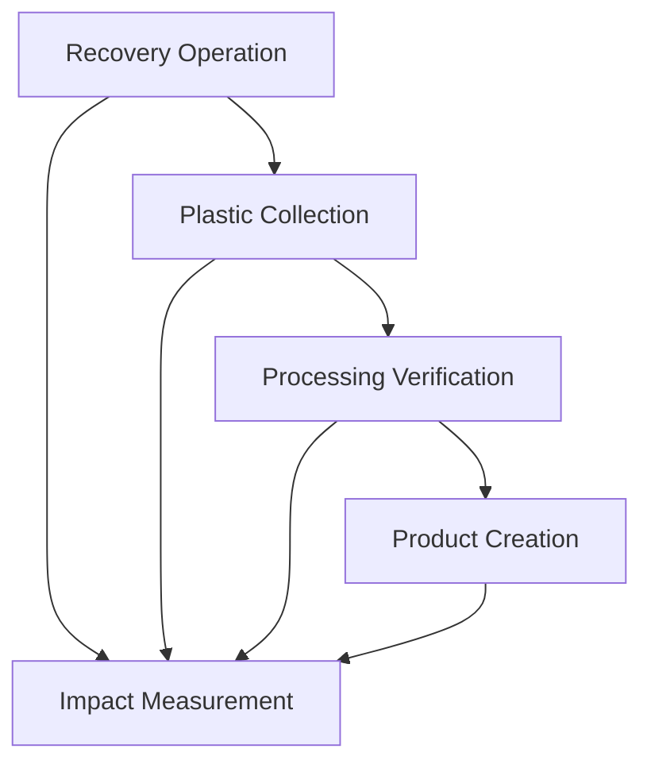

# Decentralized Environmental Ocean Plastic Recovery

A comprehensive blockchain-based system for tracking and verifying ocean plastic recovery operations, from collection to product creation, built on the Stacks blockchain using Clarity smart contracts.

## Overview

This project implements a decentralized system to incentivize and track ocean plastic cleanup efforts. The system provides transparency, verification, and traceability throughout the entire lifecycle of ocean plastic recovery and recycling.

## System Architecture

The system consists of five interconnected smart contracts:

### 1. Recovery Operation Verification (`recovery-operation.clar`)
- **Purpose**: Validates and tracks ocean cleanup initiatives
- **Key Features**:
    - Register cleanup operations with location and estimated plastic amounts
    - Authorized verifier system for operation validation
    - Status tracking (pending, verified, rejected)
    - Immutable record of all cleanup activities

### 2. Plastic Collection Contract (`plastic-collection.clar`)
- **Purpose**: Tracks recovered ocean plastic quantities and ownership
- **Key Features**:
    - Record plastic collections linked to verified operations
    - Track plastic balances by type and owner
    - Enable plastic transfers between parties
    - Maintain collection history and provenance

### 3. Processing Verification Contract (`processing-verification.clar`)
- **Purpose**: Validates plastic recycling operations
- **Key Features**:
    - Record plastic processing operations
    - Track input/output ratios and efficiency
    - Verify processing quality and methods
    - Authorized verifier system for processing validation

### 4. Product Creation Contract (`product-creation.clar`)
- **Purpose**: Records products made from ocean plastic
- **Key Features**:
    - Create product records using tracked plastic materials
    - Product certification system
    - Track plastic consumption in manufacturing
    - Maintain product provenance and authenticity

### 5. Impact Measurement Contract (`impact-measurement.clar`)
- **Purpose**: Quantifies ocean cleanup benefits and environmental impact
- **Key Features**:
    - Report environmental impact metrics
    - Track global cleanup statistics
    - Verify impact claims
    - Calculate carbon footprint reduction

## Contract Interactions



## Key Features

### Transparency
- All operations are recorded on-chain
- Public verification of cleanup activities
- Immutable audit trail from collection to product

### Verification System
- Multi-level verification with authorized validators
- Quality control at each stage of the process
- Fraud prevention through on-chain validation

### Traceability
- Complete plastic lifecycle tracking
- Product provenance verification
- Impact measurement and reporting

### Incentivization
- Transparent tracking encourages participation
- Verified operations build reputation
- Measurable impact drives continued engagement

## Getting Started

### Prerequisites
- Stacks blockchain development environment
- Clarity CLI tools
- Node.js for testing

### Installation

1. Clone the repository:
```bash
git clone <repository-url>
cd ocean-plastic-recovery
```

2. Install dependencies:
```bash
npm install
```

3. Run tests:
```bash
npm test
```

### Deployment

Deploy contracts to Stacks testnet:

```bash
# Deploy recovery operation contract
clarinet deploy --testnet contracts/recovery-operation.clar

# Deploy other contracts in order
clarinet deploy --testnet contracts/plastic-collection.clar
clarinet deploy --testnet contracts/processing-verification.clar
clarinet deploy --testnet contracts/product-creation.clar
clarinet deploy --testnet contracts/impact-measurement.clar
```

## Usage Examples

### 1. Register a Recovery Operation
```clarity
(contract-call? .recovery-operation register-operation 
  "Pacific Ocean, 34.0522°N 118.2437°W" 
  u500) ;; 500kg estimated
```

### 2. Record Plastic Collection
```clarity
(contract-call? .plastic-collection record-collection 
  u1 ;; operation-id
  "PET" ;; plastic type
  u450 ;; actual weight collected
  "Pacific Ocean, 34.0522°N 118.2437°W")
```

### 3. Process Plastic
```clarity
(contract-call? .processing-verification record-processing
  "PET" ;; input type
  u400 ;; input weight
  "rPET" ;; output type
  u350) ;; output weight (87.5% efficiency)
```

### 4. Create Product
```clarity
(contract-call? .product-creation create-product
  "Ocean Plastic Water Bottle"
  "rPET"
  u50 ;; 50kg of recycled plastic
  "Beverage Container")
```

### 5. Report Impact
```clarity
(contract-call? .impact-measurement report-impact
  u500 ;; plastic removed (kg)
  u10000 ;; area cleaned (sqm)
  u25 ;; marine life protected
  u150 ;; carbon reduced (kg)
  u1000 ;; period start
  u2000) ;; period end
```

## Testing

The project includes comprehensive tests using Vitest. Tests cover:

- Contract deployment and initialization
- Operation registration and verification
- Plastic collection and transfer
- Processing verification
- Product creation and certification
- Impact measurement and reporting
- Error handling and edge cases

Run tests with:
```bash
npm test
```

## Environmental Impact

This system aims to:

- **Reduce Ocean Plastic**: Incentivize cleanup operations through transparent tracking
- **Promote Recycling**: Create verifiable supply chains for ocean plastic
- **Measure Impact**: Quantify environmental benefits of cleanup efforts
- **Build Trust**: Provide transparent, immutable records of all activities
- **Scale Solutions**: Enable global coordination of cleanup efforts

## Contributing

1. Fork the repository
2. Create a feature branch
3. Add tests for new functionality
4. Ensure all tests pass
5. Submit a pull request

## License

This project is licensed under the MIT License - see the LICENSE file for details.

## Contact

For questions or support, please open an issue in the repository.

## Roadmap

- [ ] Integration with IoT devices for automated plastic detection
- [ ] Mobile app for field data collection
- [ ] NFT certificates for verified products
- [ ] Carbon credit integration
- [ ] Multi-chain deployment
- [ ] DAO governance implementation
